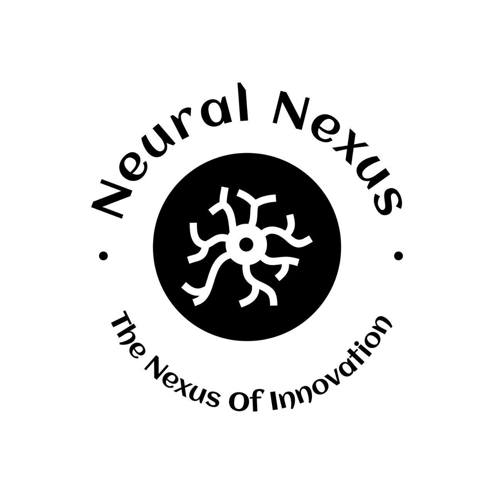

# Resume Sanchal 🤖📄

Resume Sanchal is a Resume Tailoring Cum Analysis Agent that helps users analyze and tailor their resumes according to a provided job description. It leverages AI to provide actionable insights for aligning resumes to specific job requirements, offering suggestions for improvements in skills, experience relevance, and key qualifications.

## Features

- **Job Description Input**: Users can input a job description in the text area.
- **Resume Upload**: Users can upload their resume in PDF format.
- **AI-Based Analysis**: Using Google Generative AI (Gemini-1.5-flash), the app analyzes resumes and job descriptions, providing suggestions for better alignment.
- **Skill, Experience, and Qualification Relevance**: The app generates relevance scores for different resume categories (Skills, Experience, Key Qualifications) and presents them with an ATS (Applicant Tracking System) score.
- **Interactive Dashboard**: Displays relevance scores with metrics and a visual bar chart for easy understanding.

## Demo



---

## Installation

1. **Clone the repository**:
    ```bash
    git clone https://github.com/your-repo/resume-sanchal.git
    cd resume-sanchal
    ```

2. **Install the required dependencies**:
    Make sure you have Python 3.8+ installed, then run:
    ```bash
    pip install -r requirements.txt
    ```

3. **Set up environment variables**:
    Create a `.env` file in the root directory and add your Google API Key:
    ```env
    GOOGLE_API_KEY=your_google_api_key_here
    ```

4. **Run the app**:
    To start the Streamlit application:
    ```bash
    streamlit run app.py
    ```

## Usage

1. **Open the app**:
   Once the app is running, open your browser and navigate to the local server link (e.g., `http://localhost:8501`).
   
2. **Provide Job Description**:
   - Enter the job description in the text area provided.

3. **Upload Resume**:
   - Upload your resume in PDF format by selecting the `Upload your resume` button.

4. **Analyze**:
   - The app will extract text from your resume, analyze it against the provided job description, and display suggestions for improvements in key areas such as skills, experience, and qualifications.

5. **View Relevance Scores**:
   - The app generates random relevance scores for skills, experience, and key qualifications, as well as an ATS score. These are displayed in an easy-to-understand dashboard.

6. **Visual Insights**:
   - The relevance scores are also visualized in a bar chart for better comprehension.

## Project Structure

```bash
├── app.py                 # Main Streamlit application file
├── requirements.txt       # Required Python libraries
├── .env                   # Environment variables file (add your API key here)
├── neuralnexuslogo.jpg     # Logo image displayed in the app
└── README.md              # Project documentation
